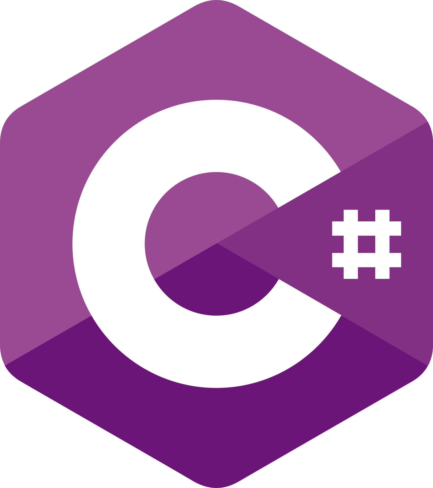
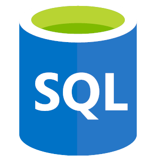
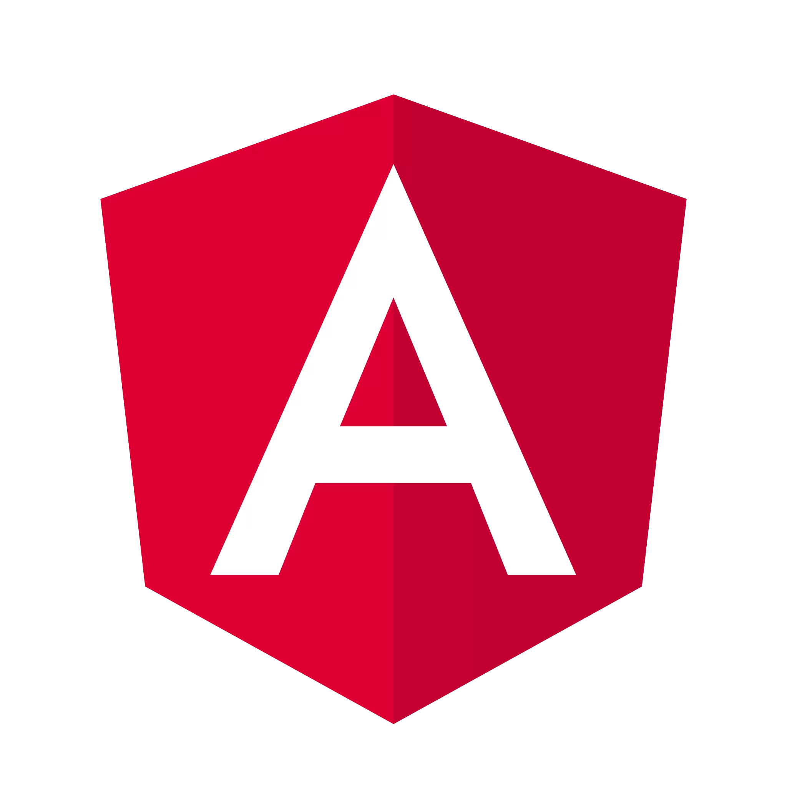
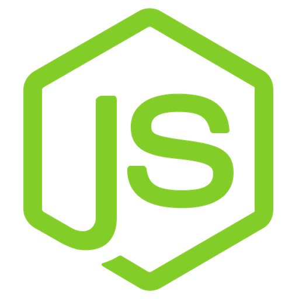

## Hi there, nice to meet you 👋! I'm Duong

---

I am a recent graduate with a degree in Computer Science from Toronto Metropolitan University (formerly Ryerson University). Here you can find my side projects ranging from websites, mobile apps, video games to desktop applications 👇.

### 📕 Programming Languages

-  JavaScript
-  Python
-  C#
-  Java
-  SQL

### ⚡ Tools & Technologies

-  Angular
-  ReactJS
-  NodeJS
-  Git & GitHub version control
-  Unity game engine

### 💡 Highlighted Projects

- [Coupling](https://github.com/ThaiDuongVu/ProjectLink): a physics-based  puzzle platformer game (C#/Unity).
- [TMU Classifieds](https://github.com/CPS630W24-Group8/TMUClassifieds) a web-based e-commerce platform (JavaScript/React/NodeJS/MongoDB)
- [Infowatch](https://github.com/ThaiDuongVu/infowatch): a mobile app for viewing Overwatch heroes (TypeScript/React Native).
- [Pong](https://github.com/ThaiDuongVu/Pong): a classic arcade Pong game (Python/Pygame).
- [ControllerX](https://github.com/ThaiDuongVu/ControllerX): a program for simulating basic keyboard & mouse input using an Xbox Controller (C++).
