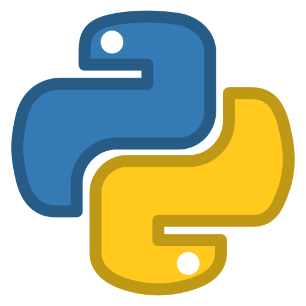
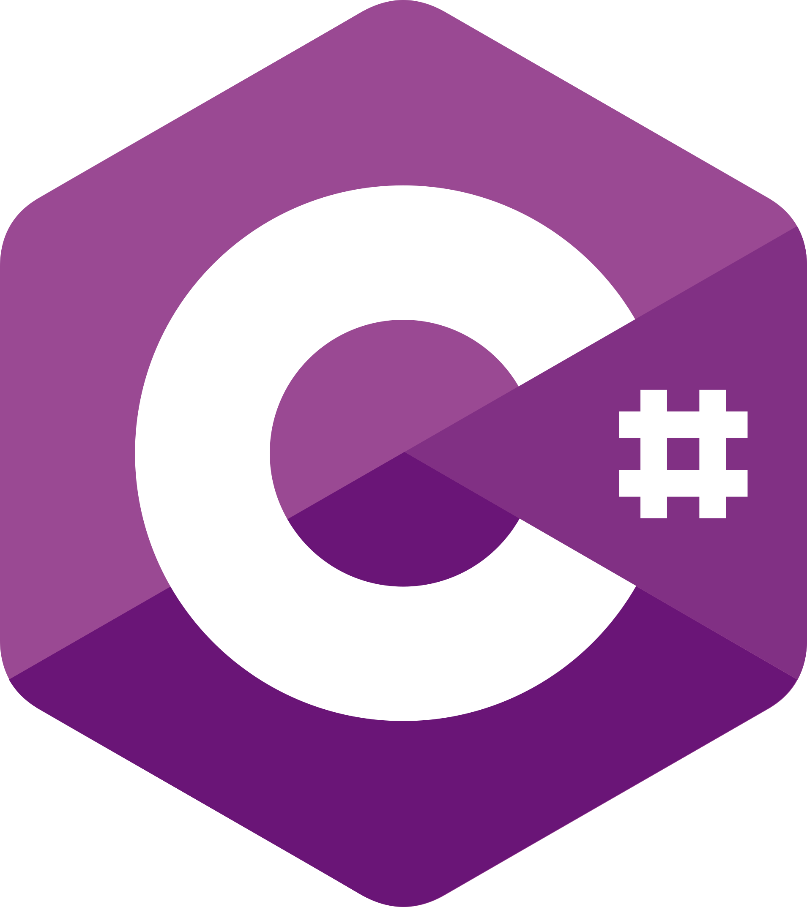
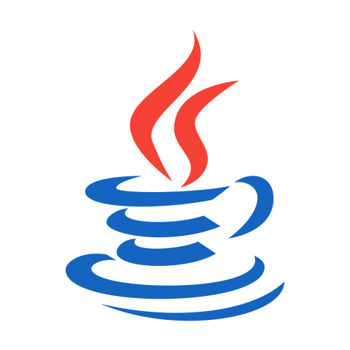
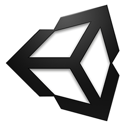
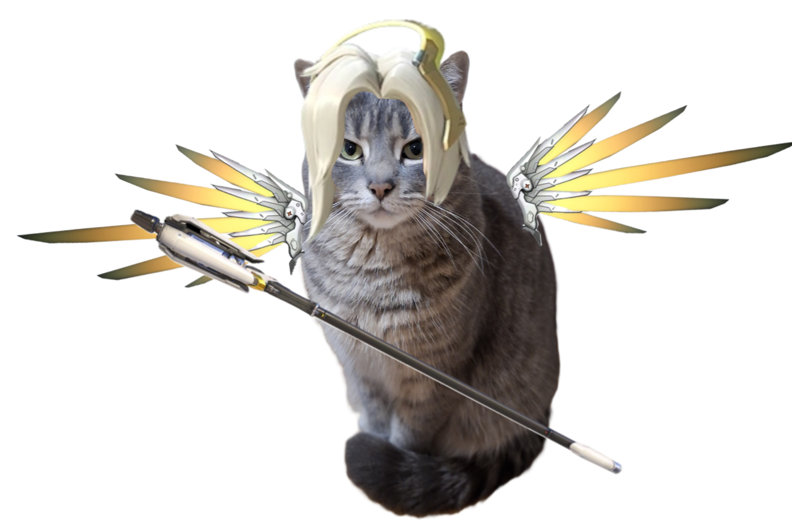
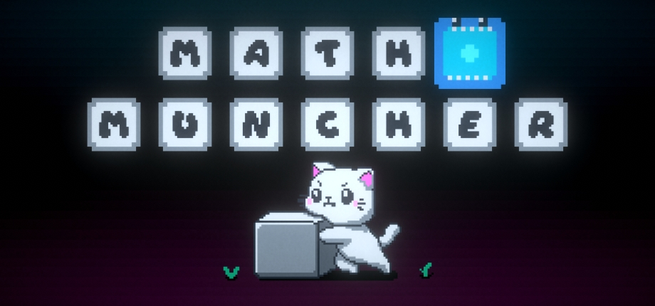
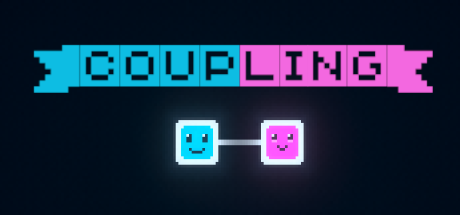
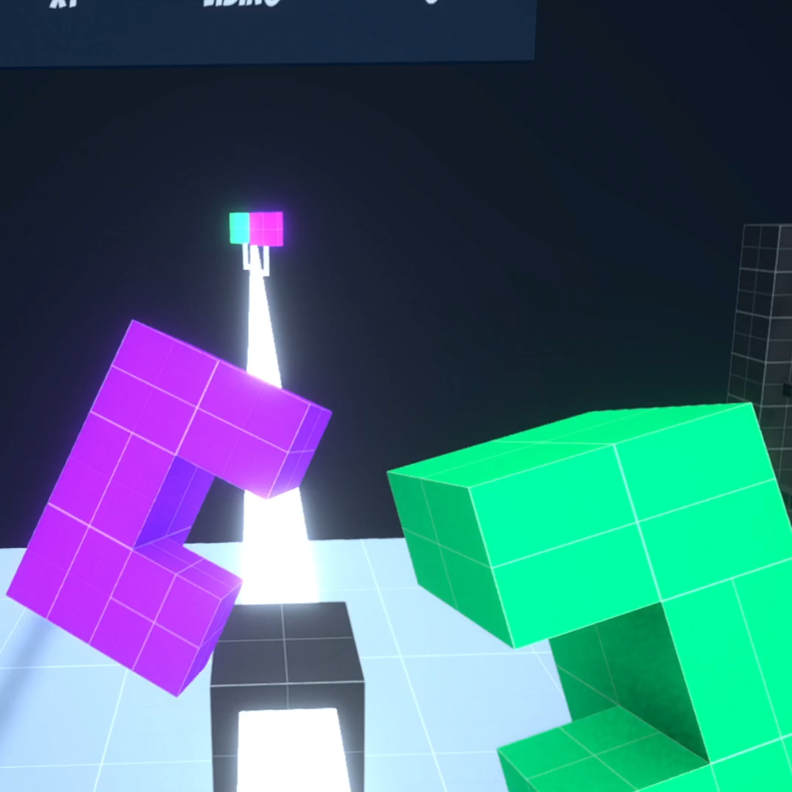

# Hi there, nice to meet you 👋! I'm Duong

I'm a Computer Science graduate from Toronto Metropolitan University (formerly Ryerson University). Here you can find my side/school projects ranging from websites, mobile apps, video games to desktop applications 👇.

## 📕 Programming Languages

-  TypeScript /  JavaScript
-  Python
-  C#
-  Java
-  SQL

## ⚡ Tools & Technologies

-  React
-  React Native
-  Node
-  Git version control
-  Unity game engine

## 💡 Highlighted Projects

- **[pawverwatch](https://github.com/ThaiDuongVu/pawverwatch)** : a React app to turn images of pets into Overwatch heroes (TypeScript/React/NextJS). Available on **[pawver.watch](https://pawver.watch)**.

- **[Math Muncher](https://github.com/ThaiDuongVu/MathMuncher)**: a relaxing block-pushing puzzle game where you do math and feed a hungry monster.  (C#/Unity). Available on **[Steam](https://store.steampowered.com/app/3450940/Math_Muncher/)**.

- **[Coupling](https://github.com/ThaiDuongVu/Coupling)**: a physics-based puzzle platformer game where the player controls two characters chained together by a link.  (C#/Unity). Available on **[Steam](https://store.steampowered.com/app/2753220/Coupling/)**.

- **[Musical Boxing](https://github.com/ThaiDuongVu/ProjectBoxing)**: a rhythm VR boxing game demo for CPS643: Virtual Reality. Project demo **[website](https://thaiduongvu.github.io/cps643-project-presentation/)**.

- **[infowatch](https://github.com/ThaiDuongVu/infowatch)**: a mobile application that provides information on Overwatch heroes/maps/players (TypeScript/React Native).
- **[Pong](https://github.com/ThaiDuongVu/Pong)**: a classic arcade Pong game (Python/Pygame).
- **[ControllerX](https://github.com/ThaiDuongVu/ControllerX)**: a program for simulating basic keyboard & mouse input using an Xbox Controller (C++).
