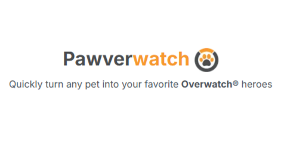

# Hi there, nice to meet you 👋! I'm Duong

I'm a Computer Science graduate from Toronto Metropolitan University (formerly Ryerson University). Here you can find my side/school projects ranging from websites, mobile apps, video games to desktop applications 👇

## 📕 Programming Languages

-  TypeScript /  JavaScript
-  Python
-  C#
-  Java
-  SQL

## ⚡ Tools & Technologies

-  React
-  React Native
-  Node
-  Git version control
-  Unity game engine

## 💡 Highlighted Projects

- **[pawverwatch](https://github.com/ThaiDuongVu/pawverwatch)**  `TypeScript/React/NextJS` - a web app to turn images of pets into Overwatch heroes. Available on **[pawver.watch](https://pawver.watch)** 
- **[Math Muncher](https://github.com/ThaiDuongVu/MathMuncher)** `C#/Unity` - a relaxing block-pushing puzzle game. Available on **[Steam](https://store.steampowered.com/app/3450940/Math_Muncher/)** 
- **[Coupling](https://github.com/ThaiDuongVu/Coupling)** `C#/Unity` - a physics-based puzzle platformer game (C#/Unity). Available on **[Steam](https://store.steampowered.com/app/2753220/Coupling/)** 
- **[Musical Boxing](https://github.com/ThaiDuongVu/ProjectBoxing)** `C#/Unity` - a rhythm VR boxing game demo for CPS643: Virtual Reality. Project demo **[website](https://thaiduongvu.github.io/cps643-project-presentation/)** 
- **[infowatch](https://github.com/ThaiDuongVu/infowatch)** `TypeScript/React Native` - a mobile application that provides information on Overwatch heroes/maps/players
- **[Pong](https://github.com/ThaiDuongVu/Pong)** `Python/Pygame` - a classic arcade Pong game
- **[ControllerX](https://github.com/ThaiDuongVu/ControllerX)** `C++` - a program for simulating basic keyboard & mouse input using an Xbox Controller
